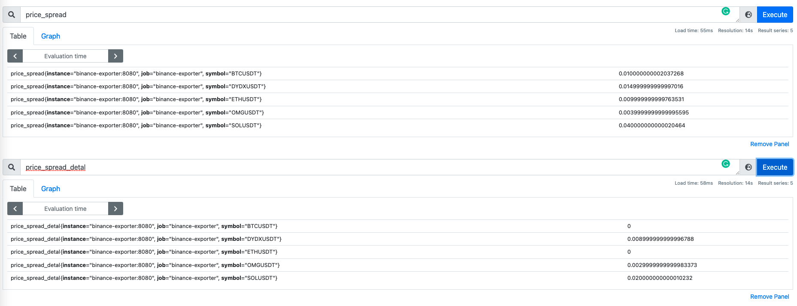

# Binance Assigment

## Assignment

- Use public market data from the SPOT API at <https://api.binance.com>
- Binance API spot documentation is at <https://github.com/binance-exchange/binance-official-api-docs/>
- All answers should be provided as source code written in either Go, Python, Java, Rust, and/or Bash.

## Questions

1. Print the top 5 symbols with quote asset BTC and the highest volume over the last 24 hours in descending order.
2. Print the top 5 symbols with quote asset USDT and the highest number of trades over the last 24 hours in descending order.
3. Using the symbols from Q1, what is the total notional value of the top 200 bids and asks currently on each order book?
4. What is the price spread for each of the symbols from Q2?
5. Every 10 seconds print the result of Q4 and the absolute delta from the previous value for each symbol.
6. Make the output of Q5 accessible by querying <http://localhost:8080/metrics> using the Prometheus Metrics format.

## Solution

- Use [binance-connector-python](https://github.com/binance/binance-connector-python) to get data from SPOT API
- All questions from 1 to 5 are processed in 2 mains files:
  - `binance_exporter/assignment.py`
  - `binance_exporter/data_processor.py`
- Use `prometheus-client` to provice Prometheus Metrics format in question 6
- Use `unittest` to write test in `tests` directory
- Use `coverage` to generate code coverage
- Use `pylint` for check coding convention and quality checker
- When processing data, using `lamda` function and functional programing like `map, filter` to make code is short and easier to read
- Build docker image and prepare `docker-compose` so the application could run on differrent environment and ready to setup CI/CD
- Use `make` to run common tasks while developing

### Requirements

- Python 3 (python 3.9 is used for develop environment)
- Pip (if you would like to use virtualenv)
- gcc (to build `uwsgi` lib)

### Preparing environment

- Goto project dir
- Install `virtualenv`

  ```bash
  pip install virtualenv
  ```

- Create `virtualenv` for this project

  ```bash
  virtualenv .env
  ```

- Activate `virtualenv`

  ```bash
  source .env/bin/activate
  ```

- Deactivate `virtualenv`

  ```bash
  deactivate
  ```

### Install python libs

- Goto project dir
- Run pip command to install

  ```bash
  pip install -r requirements-dev.txt
  ```

### Run test

- Goto project dir
- Run unittest

  ```bash
  python -m unittest discover -s test/ -p 'test_*.py'
  ```

- Using make

  ```bash
  make test
  ```

  OUTPUT

  ```txt
  ......
  ----------------------------------------------------------------------
  Ran 6 tests in 0.037s

  OK
  ```

### Run code coverage

- Goto project dir
- Run unittest with coverage

  ```bash
  coverage run -m unittest discover -s test/ -p 'test_*.py'
  ```

- Command-Line Report

  ```bash
  coverage report -m
  ```

- HTML Report

  ```bash
  coverage html
  open html_cov/index.html
  ```

- Using make

  ```bash
  make coverage
  ```

  OUTPUT

  ```bash
  coverage run -m unittest discover -s tests/ -p 'test_*.py'; coverage report -m
  ......
  ----------------------------------------------------------------------
  Ran 6 tests in 0.112s

  OK
  Name                                  Stmts   Miss  Cover   Missing
  -------------------------------------------------------------------
  binance_exporter/assignment.py          114     47    59%   18-24, 76-79, 114-117, 144-147, 152-155, 168, 183, 214, 231, 242-274
  binance_exporter/configs.py               9      0   100%
  binance_exporter/custom_decrator.py      37     12    68%   18-32
  binance_exporter/data_processor.py       29      0   100%
  tests/test_assignment.py                 27      0   100%
  tests/test_data_processor.py             18      0   100%
  -------------------------------------------------------------------
  TOTAL                                   234     59    75%
  ```

### Run application

- Goto project dir
- View help

  ```bash
  python -m binance_exporter.exporter --help
  usage: exporter.py [-h] [--port PORT] [--update-interval UPDATE_INTERVAL]
                    [--loglevel [{CRITICAL,ERROR,WARNING,INFO,DEBUG}]]

  optional arguments:
    -h, --help            show this help message and exit
    --port PORT, -p PORT  Exporter port number
    --update-interval UPDATE_INTERVAL, -i UPDATE_INTERVAL
                          Price spread update interval
    --loglevel [{CRITICAL,ERROR,WARNING,INFO,DEBUG}], -l [{CRITICAL,ERROR,WARNING,INFO,DEBUG}]
                          Log level
  ```

- Start the app

  ```bash
  make run
  ```

  OUTPUT

  ```txt
  1. Print the top 5 symbols with quote asset BTC and the highest volume over the last 24 hours in descending order.
  ['BTCDOWNUSDT', 'IOSTBTC', 'SCBTC', 'STPTBTC', 'ZILBTC']

  2. Print the top 5 symbols with quote asset USDT and the highest number of trades over the last 24 hours in descending order.
  ['BTCUSDT', 'ETHUSDT', 'OMGUSDT', 'AVAXUSDT', 'DYDXUSDT']

  3. Using the symbols from Q1, what is the total notional value of the top 200 bids and asks currently on each order book?
  {
      "BTCDOWNUSDT": {
          "bids": 356900.6863017002,
          "asks": 4200954.368134596
      },
      "IOSTBTC": {
          "bids": 108.83334127999993,
          "asks": 251269.01390464997
      },
      "SCBTC": {
          "bids": 130.03664908000005,
          "asks": 123890.31297555998
      },
      "STPTBTC": {
          "bids": 7.188952839999999,
          "asks": 35.54994476999999
      },
      "ZILBTC": {
          "bids": 31.12445506999999,
          "asks": 119251.60395744005
      }
  }

  4. What is the price spread for each of the symbols from Q2?
  {
      "BTCUSDT": 0.010000000002037268,
      "ETHUSDT": 0.009999999999763531,
      "OMGUSDT": 0.005000000000000782,
      "AVAXUSDT": 0.01999999999999602,
      "DYDXUSDT": 0.004000000000001336
  }

  5. Every 10 seconds print the result of Q4 and the absolute delta from the previous value for each symbol.
  Check log in 10 seconds ...

  6. Make the output of Q5 accessible by querying http://localhost:8080/metrics using the Prometheus Metrics format.
  Please open http://localhost:8080/metrics on your browser

  Last price spread
  {'BTCUSDT': 0.020000000004074536, 'ETHUSDT': 0.010000000000218279, 'OMGUSDT': 0.009000000000000341, 'AVAXUSDT': 0.01999999999999602, 'DYDXUSDT': 0.003999999999997783}
  The absolute delta from the previous value
  {'BTCUSDT': 0.010000000002037268, 'ETHUSDT': 4.547473508864641e-13, 'OMGUSDT': 0.0039999999999995595, 'AVAXUSDT': 0.0, 'DYDXUSDT': 3.552713678800501e-15}
  Last price spread
  {'BTCUSDT': 0.010000000002037268, 'ETHUSDT': 0.009999999999763531, 'OMGUSDT': 0.0039999999999995595, 'AVAXUSDT': 0.030000000000001137, 'DYDXUSDT': 0.003999999999997783}
  The absolute delta from the previous value
  {'BTCUSDT': 0.010000000002037268, 'ETHUSDT': 4.547473508864641e-13, 'OMGUSDT': 0.005000000000000782, 'AVAXUSDT': 0.010000000000005116, 'DYDXUSDT': 0.0}
  ```

### Docker

- Goto project dir
- Build image

  ```bash
  make docker-build
  ```

- Run application with `docker-compose`

  ```bash
  cd docker
  docker-compose up -d
  ```

- View prometheus UI at [http://localhost:9090](http://localhost:9090) to check metrics

  

### TODO

- Add more tests to cover abnormal cases
- Improve `Assignment.py` to increase code coverage
- Improve code format to clear pylint warning
- Add validator for function parameters and server's responses
- User docker multi-stage build to build new image faster when just update code
